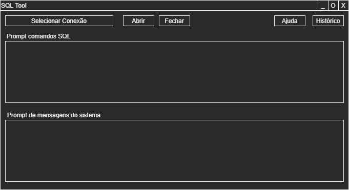

# Projeto ferramenta para execução de queries SQL em ambientes com múltiplos banco de dados

## Visão Geral
Este projeto visa criar uma ferramenta de gerenciamento de banco de dados que se conecte a vários tipos de sistemas de banco de dados. A ferramenta permitirá executar comandos SQL e visualizar os resultados.

## Requisitos iniciais de implementação

### Interface do Usuário
A interface do usuário é dividida em várias seções principais:



- **Seleção de Conexão**: Uma área dedicada para selecionar entre as conexões de banco de dados configuradas.
- **Prompt de Comandos SQL**: Um prompt interativo onde os usuários podem digitar e executar comandos SQL.
	- Os comando são executados ao teclar Enter. Implementar enter no texto utilizando shift+enter.
	- Se o comando for do tipo SELECT o resultado deve ser apresentado em uma nova janela independente no formato de tabela.
	- Se o comando for do tipo DELETE ou DROP exibir uma caixa de dialogo de confirmação.
- **Área de Mensagens do Sistema**: Uma seção para exibir mensagens de retorno do sistema, como erros ou confirmações.
- **Histórico**: Um registro de comandos SQL executados anteriormente.
	- Exibir uma nova janela com o log dos comandos executados e seus retornos.

### Especificações Técnicas
#### Configurações do Banco de Dados
As configurações devem ser armazenadas em um arquivo YAML seguindo o formato especificado anteriormente.

#### Classe de Acesso às Configurações
Uma classe em C# deve ser implementada para gerenciar a leitura e o acesso às configurações do arquivo YAML.

#### Implementação da Interface
A interface do usuário deve ser desenvolvida conforme o desenho fornecido, com funcionalidades claras e intuitivas para interação com os bancos de dados.

### Desenvolvimento
Este projeto será desenvolvido para fins didáticos, focando em práticas de codificação limpa, documentação clara e testes unitários.

### Configurações do Banco de Dados
As configurações de cada banco de dados devem ser armazenadas em um arquivo YAML. Este arquivo conterá informações como tipo de banco de dados, credenciais e outras configurações específicas.

#### Formato do Arquivo de Configuração
O arquivo de configuração `config.yaml` deve seguir o seguinte formato:

```yaml
databases:
  - type: MySQL
    host: localhost
    port: 3306
    name_db: exemplo_mysql
    user: usuario_mysql
    password: senha_mysql

  - type: PostgreSQL
    host: localhost
    port: 5432
    name_db: exemplo_postgres
    user: usuario_postgres
    password: senha_postgres

  - type: SQLite
    file_db: /caminho/para/arquivo_sqlite.db

# Adicione mais configurações conforme necessário.
```

#### Classe de Acesso às Configurações
Você deve implementar uma classe em C# que seja responsável por carregar estas configurações do arquivo YAML. Esta classe deve:

- Ser capaz de ler o arquivo YAML e parsear as configurações.
- Fornecer um método para acessar as configurações de cada tipo de banco de dados.
- Garantir que as informações sensíveis, como senhas, sejam tratadas de forma segura.

### Classes de Conexão aos Bancos de Dados
Elaborar classes seguindo os princípios SOLID para realizar as conexões aos diferentes tipos de bancos de dados.

### Testes
O diretório `databases` contém informações para geração de containers Docker para testes com [PostgreSQL](./databases/PostgreSQL/README.md) e [MySQL](./databases/MySQL/README.md).

### Requisitos Adicionais
- Documente claramente o código.
- Escreva testes unitários para a classe de configuração.
- Siga as melhores práticas de programação e design de software.

### Contribuição
Como este é um projeto de aprendizado, encorajamos você a experimentar e a propor melhorias ou funcionalidades adicionais. Estamos ansiosos para ver suas contribuições e discutir suas ideias.
